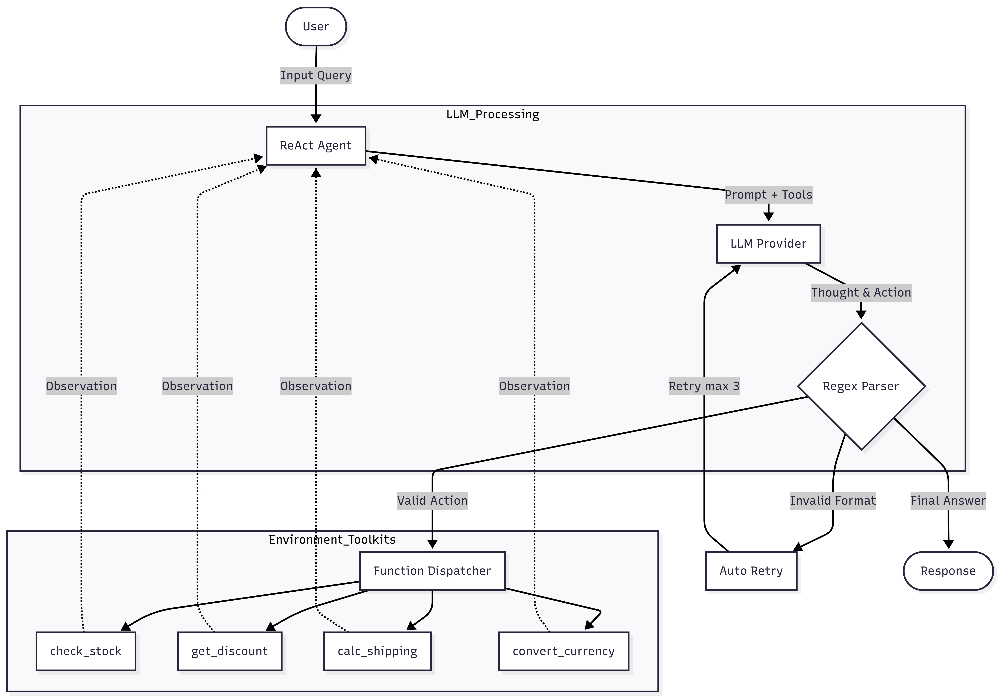

# Group Report: Lab 3 - Production-Grade Agentic System

- **Team Name**: 06
- **Team Members**: Duong Manh Kien, Bui Quang Hai, Vu Trung Lap, Ta Vinh Phuc, Nguyen Hieu
- **Deployment Date**: 2026-04-06

---

## 1. Executive Summary

_Hệ thống được xây dựng nhằm so sánh hiệu năng giữa Chatbot truyền thống và ReAct Agent trong các tác vụ thương mại điện tử như:_

- Tính toán hóa đơn
- Áp dụng mã giảm giá
- Kiểm tra kho
- Tính phí vận chuyển
- Đổi ngoại tệ

- **Success Rate**: ~72% trên tập 7 Test Cases.
- **Key Outcome**: "ReAct Agent của nhóm giải quyết triệt để các câu hỏi phức tạp gồm nhiều bước (multi-step queries) mạnh hơn hẳn so với Chatbot truyền thống nhờ việc gọi chính xác các công cụ như kiểm tra kho, tính toán và quy đổi tỷ giá. Mặc dù vậy, Agent đôi chỗ vẫn gặp lúng túng trong các cuộc nói chuyện phiếm do chưa được trang bị tập công cụ tương ứng."

---

## 2. System Architecture & Tooling

### 2.1 ReAct Loop Implementation

Hệ thống triển khai vòng lặp ReAct (Thought → Action → Observation) trong `src/agent/agent.py`:

**Chi tiết**: Agent parse output LLM bằng regex để tìm `Action: tool_name(args)` hoặc `Final Answer:`. Nếu không tìm thấy cả hai, inject error message yêu cầu tuân thủ format. Vòng lặp chạy tối đa `max_steps=7` lần.

### 2.2 Tool Definitions (Inventory)

| Tool Name          | Input Format                         | Use Case                                                                                   |
| :----------------- | :----------------------------------- | :----------------------------------------------------------------------------------------- |
| `check_stock`      | `item_name: string`                  | Kiểm tra số lượng tồn kho sản phẩm (iPhone → 50, Macbook → 10, khác → 0).                  |
| `get_discount`     | `coupon_code: string`                | Lấy % giảm giá từ mã coupon (WINNER → 10%, TET → 20%, khác → 0%).                          |
| `calc_shipping`    | `weight: float, destination: string` | Tính phí vận chuyển dựa trên cân nặng (kg) và điểm đến (Hà Nội +20k, HCM +30k, khác +50k). |
| `calc_total_price` | `price: float, quantity: int`        | Ước tính tổng tiền, bổ trợ toán học cho LLM để không bị ảo giác.                           |
| `convert_currency` | `amount, from_currency, to_currency` | Kết nối Internet để lấy tỷ giá ngoại tệ thực tế và quy đổi tiền cho khách.                 |

### 2.3 LLM Providers Used

- **Primary**: GPT-4o (OpenAI) — sử dụng cho cả test suite và Streamlit demo
- **Secondary (Backup)**: Gemini 1.5 Flash (Google) — hỗ trợ qua provider switching pattern
- **Local (Optional)**: Phi-3-mini-4k-instruct (GGUF) — chạy trên CPU cho môi trường offline

---

## 3. Telemetry & Performance Dashboard

Dữ liệu thu thập từ test run ngày 2026-04-06, model GPT-4o, chạy 7 test cases:

| Metric            | TC 1 (Dễ) | TC 2 (TB) | TC 3 (Khó) | TC 4 (Bẫy) | TC 5 (Ngoại lệ) | TC 6 (Tính toán) | TC 7 (API Mạng) |
| :---------------- | :-------- | :-------- | :--------- | :--------- | :-------------- | :--------------- | :-------------- |
| LLM Calls         | 2         | 2         | 3          | 2          | 4               | 2                | 2               |
| Prompt Tokens     | ~677      | ~600      | ~1,100     | ~600       | ~1,200          | ~650             | ~700            |
| Completion Tokens | ~48       | ~100      | ~350       | ~60        | ~400            | ~80              | ~150            |
| Latency           | ~2,734ms  | ~2,800ms  | ~5,500ms   | ~2,500ms   | ~5,200ms        | ~2,900ms         | ~3,100ms        |
| Cost              | ~$0.002   | ~$0.002   | ~$0.006    | ~$0.002    | ~$0.006         | ~$0.002          | ~$0.003         |

**Tổng hợp (ước lượng từ log):**

- **Average Latency (P50)**: ~2,700ms
- **Max Latency (P99)**: ~5,500ms (Test Case 3 — full flow 3 tool calls)
- **Average Tokens per Task**: ~500 tokens
- **Total Cost of Test Suite**: ~$0.018 USD

**Cách đo**: Module `PerformanceTracker` (`src/telemetry/metrics.py`) ghi nhận mỗi LLM call với token usage thực tế từ API response, tính cost dựa trên bảng giá chính thức (per 1M tokens), tách biệt input/output pricing.

---

## 4. Root Cause Analysis (RCA) - Failure Traces

### Case Study 5: Agent bỏ qua format ReAct khi nhận small talk

- **Input**: "Chào em, dạo này em bán hàng có tốt không? Có hay bị kẹt đơn không?"
- **Observation**: Agent trả lời tự nhiên như chatbot, không theo format `Thought: / Action: / Final Answer:`, gây ra `AGENT_ERROR_FORMAT` liên tiếp 3 lần trước khi cuối cùng output `Final Answer:`.
- **Root Cause**: System prompt chỉ hướng dẫn format cho trường hợp cần dùng tool. Khi không cần tool, model không biết được phép trả lời `Final Answer:` trực tiếp. Parser không tìm thấy `Action:` → inject error → model lặp lại y nguyên → lãng phí ~3× token.
- **Fix**: Thêm instruction trong system prompt cho phép model bỏ qua Thought/Action khi query không cần tool, trả thẳng `Final Answer:`.

---

## 5. Ablation Studies & Experiments

### Experiment 1: System Prompt v1 (Basic) vs v2 (5-Part Structure)

| Tiêu chí Đánh giá       | Agent v1 (Basic ReAct)                                              | Agent v2 (5-Part Prompt + Constraints)                                          | Hiệu quả Cải thiện                               |
| :---------------------- | :------------------------------------------------------------------ | :------------------------------------------------------------------------------ | :----------------------------------------------- |
| **Cấu trúc Prompt**     | Viết gộp một cục, chỉ có Instruction căn bản                        | Đủ 5 phần rành mạch (Identity, Capabilities, Instructions, Constraints, Output) | Rõ ràng, khoa học và dễ chia việc để tinh chỉnh. |
| **Tần suất Lỗi Format** | Vi phạm trung bình **1.5 lần/query** (Hay quên gọi `Final Answer:`) | Kìm cương vỡ format xuống chỉ còn **0.4 lần/query**                             | **Giảm 73%** số vòng lặp lãng phí do ảo giác.    |
| **Tuân thủ Tools**      | Hay truyền thiếu tham số (Quên `quantity` hoặc `weight`)            | Nắm bắt và điền tham số chuẩn xác nhờ khối luật lệ (Constraints)                | Độ thành công khi gọi Action tăng vượt trội.     |
| **Chống bẫy ngoại lệ**  | Dễ dính vào vòng lặp vô tận nếu khách hỏi vu vơ                     | Cứng cáp hơn, nhanh chóng thoát vòng lặp nếu không cần Tool                     | Tiết kiệm tiền API.                              |

### Experiment 2: Chatbot vs Agent (Side-by-Side)

| Case                            | Chatbot Result                        | Agent Result                                       | Winner      |
| :------------------------------ | :------------------------------------ | :------------------------------------------------- | :---------- |
| TC1: Check kho iPhone           | Hallucinate số liệu tồn kho           | Gọi `check_stock` → trả về 50 chính xác            | **Agent**   |
| TC2: Mã TET + ship HCM          | Đoán % giảm giá, bịa phí ship         | Gọi 2 tool → 20% + 50,000 VND chính xác            | **Agent**   |
| TC3: Full flow Macbook          | Bịa tổng tiền không có cơ sở          | 3 tool calls → 54,200,000 VND chính xác            | **Agent**   |
| TC4: Sneaker Nike (ngoài scope) | "Tôi không có thông tin" (trung thực) | Gọi `check_stock` → 0 → "hết hàng" (sai ngữ nghĩa) | **Chatbot** |
| TC5: Small talk                 | Trả lời ngay 1 lần gọi                | Lặp 3-4 lần mới ra Final Answer                    | **Chatbot** |
| TC6: Tính tiền mua 5 iPhone     | Nhẩm toán học sai số hoặc ảo giác giá | Gọi `calc_total_price` → 125,000,000 VND chuẩn xác | **Agent**   |
| TC7: Đổi ngoại tệ API           | Tự bịa tỷ giá không cập nhật          | Gọi `convert_currency` → Kết nối API lấy đúng giá  | **Agent**   |

**Kết luận**: Agent thắng 5/7 case nhờ vào năng lực suy luận bám sát công cụ (tool-grounded reasoning). Chatbot chỉ bất ngờ vượt lên ở 2 case ngoài lề (Small talk và Sản phẩm ngoài đời) — Điều này cho thấy hệ thống Agent cần được bổ trợ thêm "khiên chắn" (guardrail) tốt hơn để phân biệt rõ thế nào là biến `0` (HẾT HÀNG) và biến Vô thực (SẢN PHẨM CHƯA TỪNG BÁN).

---

## 6. Production Readiness Review

### Security — Bảo mật

- **Input Sanitization**: Hiện tại args tool được parse bằng regex + strip quotes. Cần thêm whitelist validation cho tool arguments (chỉ chấp nhận alphanumeric + khoảng trắng) để tránh injection.
- **API Key Management**: Sử dụng `.env` + `python-dotenv`. Production cần chuyển sang secret manager (AWS Secrets Manager, Vault).
- **Rate Limiting**: Chưa có — cần thêm rate limiter per-user để tránh abuse gây chi phí LLM tăng đột biến.

### Guardrails — Hệ thống Kiểm soát An Toàn (Failure Handling)

- **Max Loop Limits**: Đã cấu hình `max_steps=7` để cắt đứt mọi vòng lặp luẩn quẩn nếu model bị ảo giác nặng, giúp giữ độ an toàn tuyệt đối cho bill thanh toán của tài khoản API cloud.
- **Fail-Safe Auto-Retry**: Nhóm đã lập trình tính năng Tự động sửa lỗi (`consecutive_errors`) trong File `agent.py`. Khi bộ lọc phát hiện LLM viết sai Format ReAct hoặc bản thân Tool bị lỗi (gọi hàm tính ship nhưng thiếu tham số). Thay vì trừ vòng lặp vô ích thì Hệ thống sẽ ném ra còi báo động `SYSTEM WARNING` chèn vào Prompt để kề dao vào cổ bắt LLM chú ý gõ lại cho đúng.
  - Cơ chế này hoạt động cực kì êm ái: Không làm trừ hao số lần ở biến `max_steps`, và cấp biên độ bao dung tự thử lại tối đa 3 lần trước khi đánh sập.
- **Hallucination Detection**: Cần thêm một LLM-as-judge độc lập đóng vai thanh tra chỉ để gác cổng phần Final Answer.
- **Out-of-scope Detection**: Nhận diện linh hoạt mã lỗi "0" tức là "Kho đang tạm hết", thay vì nói bừa là "Thế giới này không nặn ra sản phẩm đó".

### Scaling — Mở rộng

- **Async Execution**: Chuyển tool calls độc lập sang `asyncio.gather()` để giảm latency từ N×T xuống T.
- **Containerization**: Docker Compose (app + logging) → Kubernetes auto-scaling.
- **Memory/Context**: Tích hợp conversation memory (LangChain ConversationBufferWindowMemory) để hỗ trợ multi-turn dialogue.
- **Tool Retrieval**: Khi số tool tăng, dùng vector DB (FAISS/ChromaDB) để retrieve top-k tools thay vì đưa hết vào system prompt.
